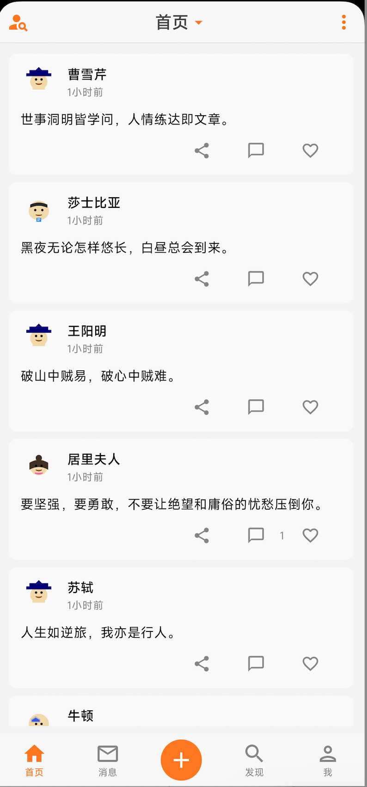
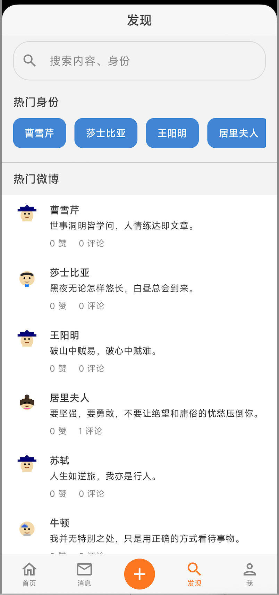
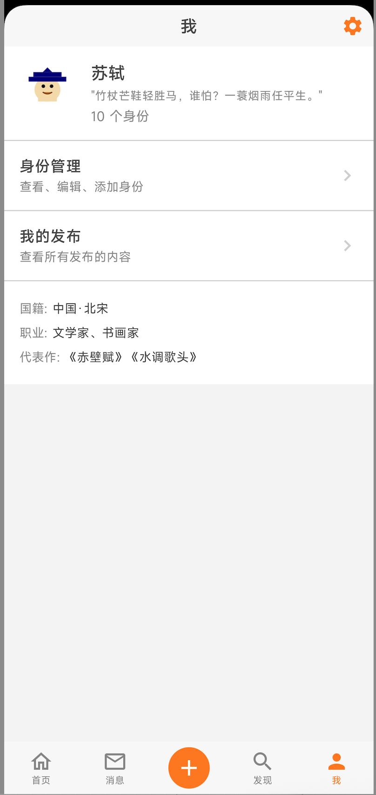
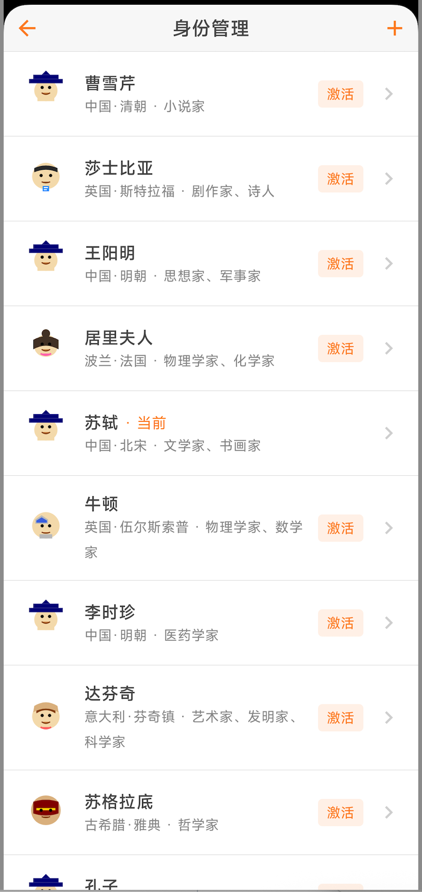

# PocketWeibo

A Weibo-like local notes app built with Jetpack Compose, Kotlin, and Room database.

## Features

### Core Features

- **Multi-Identity System**: Create and manage multiple identities (historical figures) and post content as different personas
- **Post Management**: Create, view, like, comment, and share posts
- **Comment System**: Add comments to posts with identity selection
- **Identity Details**: Each identity includes nationality, gender, birth/death years, occupation, motto, famous works, and bio
- **Cartoon Avatars**: 8 different cartoon avatar styles for identities
- **Swipe-Back Navigation**: Android-style swipe-back gesture support

### Screens

1. **Home**: Main feed showing all posts in a scrollable list
2. **Message**: View received and sent comments/notifications
3. **Discover**: Search for identities and posts, trending content
4. **Me**: View current identity, manage identities, see personal posts
5. **Compose**: Create new posts with identity selection
6. **Post Detail**: Full post view with comments
7. **Identity List**: Manage all identities (CRUD)
8. **Identity Detail**: View/edit individual identity details

### UI Design

- Twitter-like card design with rounded corners and subtle shadows
- Weibo orange (#FD8225) accent color
- Bottom 5-tab navigation
- Real-time like and comment counts
- Relative timestamps with milliseconds precision

## Screenshots

### Home Screen

Main feed showing posts with action buttons (share, comment, like).

### Discover Screen

Search and discover trending posts and identities.

### Message Screen

View received and sent comments.

### Me Screen

Manage identity and view personal posts.

### Compose Screen

Create new posts with identity selection.

## TODO

### Home Screen
- [ ] Improve action button alignment and spacing
- [ ] Add visual feedback on button press

### Post Card
- [x] Card design with elevation and rounded corners
- [x] Avatar display with cartoon images
- [x] Action buttons (share, comment, like) on right side
- [ ] Share button functionality
- [ ] Better liked/unliked visual indicator
- [ ] Reduce avatar image background (currently has yellowish tint)

### Post Detail Screen
- [x] Post content fully visible when typing comment
- [x] Comment input with keyboard handling
- [ ] Comment functionality improvement
- [ ] Reply to specific comments
- [x] Delete own comments (UI placeholder)

### Compose Screen
- [ ] Image attachment support
- [ ] Post preview before publishing
- [ ] Draft saving
- [ ] Character count limit

### Identity Management
- [x] Identity list with CRUD operations
- [x] Identity detail screen
- [ ] Edit identity photo/avatar
- [ ] Identity switch animation
- [ ] Quick identity switch from home screen

### Discover Screen
- [x] Trending posts section
- [x] Search by identity name or post content
- [ ] Filter by date range
- [ ] Filter by identity
- [ ] Trending topics/tags

### Message Screen
- [x] Received comments view
- [x] Sent comments view
- [ ] Push notification support
- [ ] Unread message indicator

### General
- [ ] Dark mode support
- [ ] Data export/backup (JSON format)
- [ ] Data import/restore
- [ ] App icon customization

### Avatar Management
- [ ] Upload custom avatar from gallery
- [ ] Take photo with camera for avatar
- [ ] Crop/resize avatar image
- [ ] Avatar compression and optimization
- [ ] Avatar preview before saving
- [ ] Remove/reset avatar to default

### Comments
- [ ] Delete own comments
- [ ] Edit own comments
- [ ] Long press to copy comment
- [ ] Comment reactions/likes
- [ ] Sort comments (newest/oldest)

### Data Management
- [ ] Export all data (posts, comments, identities) to JSON
- [ ] Export data to CSV format
- [ ] Import data from JSON backup
- [ ] Selective data export (posts only, identities only, etc.)
- [ ] Data migration between app versions
- [ ] Clear all data option

## Tech Stack

- **Language**: Kotlin
- **UI Framework**: Jetpack Compose
- **Database**: Room
- **Architecture**: MVVM
- **Build System**: Gradle with KSP

## Database Schema

### IdentityEntity
- id (Primary Key)
- name
- avatarResName
- nationality
- gender
- birthYear / deathYear
- occupation
- motto
- famousWork
- bio
- isActive

### PostEntity
- id (Primary Key)
- identityId (Foreign Key)
- content
- imageUris
- createdAt
- likeCount
- commentCount
- isLiked

### CommentEntity
- id (Primary Key)
- postId (Foreign Key)
- identityId (Foreign Key)
- content
- createdAt

## Getting Started

1. Clone the repository
2. Open in Android Studio
3. Sync Gradle
4. Run on device/emulator

## License

Private project for personal use.
